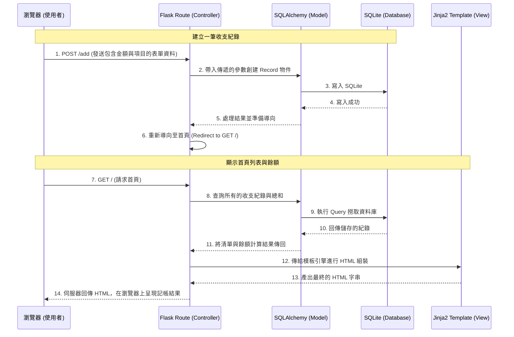

# 系統架構設計文件 (ARCHITECTURE) - 個人記帳簿系統

## 1. 技術架構說明

為了快速建置且易於維護，本系統採用非前後端分離的單體式架構 (Monolithic Architecture)。我們選擇以下技術組合：

- **選用技術與原因**：
  - **後端框架：Python + Flask**
    輕量級、彈性高且易上手，非常適合用來建立個人記帳簿這種功能單純的微型網頁服務。
  - **模板引擎：Jinja2**
    無需撰寫複雜的 JavaScript 框架，可直接在 HTML 當中動態帶入後端傳遞的收支紀錄資料並完成渲染，降低開發門檻。
  - **資料庫：SQLite (搭配 SQLAlchemy ORM)**
    不需要額外安裝或設定資料庫伺服器，單一檔案即可完成儲存，這對於個人使用或 MVP 版本來說是最快速且零負擔的選擇。搭配 SQLAlchemy ORM 能讓資料庫操作更符合 Python 使用習慣。

- **Flask MVC 模式說明**：
  - **Model (模型)**：負責定義支出與收入的資料表結構 (Schema)，處理與 SQLite 之間的溝通。
  - **View (視圖)**：Jinja2 模板，負責介面的展示，會接收 Controller 傳遞的變數並渲染成最終的網頁。
  - **Controller (控制器/路由)**：Flask 的路由定義 (Routes)，負責處理瀏覽器發送的 HTTP 請求、呼叫 Model 取得或寫入資料、並將資訊指派給 View 進行渲染。

## 2. 專案資料夾結構

整個專案將採取模組化的結構來管理，以利後續功能的擴充：

```text
web_app_development/
├── app/                      ← 應用程式核心目錄
│   ├── __init__.py           ← Flask App 初始化與套件設定配置
│   ├── models/               ← 資料庫模型 (Model)
│   │   └── record.py         ← 定義收支紀錄的資料表結構
│   ├── routes/               ← Flask 路由 (Controller)
│   │   └── main_routes.py    ← 主要的收支操作與頁面請求路由
│   ├── templates/            ← Jinja2 HTML 模板 (View)
│   │   ├── base.html         ← 基礎模板 (共用的 Layout，包含 Header/Footer 等)
│   │   └── index.html        ← 首頁 (記帳列表與餘額顯示)
│   └── static/               ← 靜態資源檔案
│       ├── css/
│       │   └── style.css     ← 自訂樣式表管理
│       └── js/
│           └── script.js     ← 負責前端基本的互動行為
├── docs/                     ← 文件目錄
│   ├── PRD.md                ← 產品需求文件
│   └── ARCHITECTURE.md       ← 系統架構設計文件 (本文件)
├── instance/                 
│   └── database.db           ← SQLite 實體資料庫檔案 (本地運行時自動產生)
├── requirements.txt          ← Python 依賴套件清單 (如 Flask, Flask-SQLAlchemy)
└── app.py                    ← 專案的執行入口，用來啟動本地伺服器
```

## 3. 元件關係圖

以下利用 Mermaid 語法展示整個系統中的請求與回應流程：



## 4. 關鍵設計決策

1. **整合單一收支紀錄表 (One Record Table)**
   - **原因**：這套系統不論是紀錄「收入」還是「支出」，欄位多數高度重疊（如日期、項目、金額）。因此不將它們拆成兩張表，而是透過一個 `type` 欄位 (`expense` / `income`) 來做區分。如此在計算餘額或要按時間排序顯示綜合明細時查詢效能更好且設計單純。
2. **採用 SQLAlchemy 做為 ORM 方案**
   - **原因**：能將繁瑣的 SQL 語法轉化為易維護的 Python 程式碼，且因為自動使用 Parameterized 傳遞參數，能避免常規的 SQL 注入攻擊，提升安全與開發效率。
3. **選擇 Flask Blueprint 進行路由設計 (如 `main_routes.py`)**
   - **原因**：雖然本專案初期簡單，但是提早將路由從 `app.py` 中拆分出來放進 `routes/` 目錄底下集中管理，以防未來功能擴充（例如報表或多語系）造成單一檔案過大難以維護。
