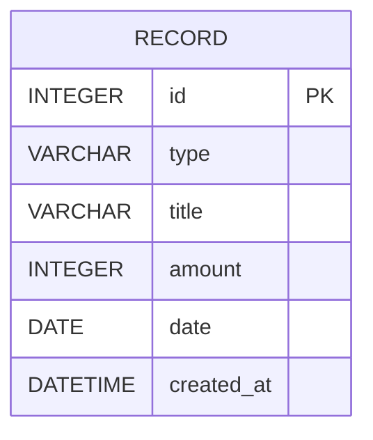

# 資料庫設計文件 (DB DESIGN) - 個人記帳簿系統

本文件根據專案需求與系統架構，定義系統中用於儲存收支紀錄的 SQLite 資料表結構。

## 1. ER 圖（實體關係圖）

我們採用單一資料表設計（One Record Table），透過 `type` 欄位區分「支出」與「收入」。

## 2. 資料表詳細說明

### 資料表：`records`

| 欄位名稱 | 資料型別 | 必填 | 預設值 | 說明 |
| :--- | :--- | :--- | :--- | :--- |
| `id` | INTEGER | 是 | Auto Increment | 該筆紀錄的唯一識別碼 (Primary Key) |
| `type` | VARCHAR | 是 | 無 | 類型，用於區分 `'income'` (收入) 與 `'expense'` (支出) |
| `title` | VARCHAR | 是 | 無 | 收支的項目名稱 (例如：午餐、薪水、交通費) |
| `amount` | INTEGER | 是 | 無 | 金額數值 (確保無小數誤差，使用整數儲存為佳) |
| `date` | DATE | 是 | 無 | 消費或收入發生的實際日期 |
| `created_at` | DATETIME | 是 | Current Timestamp| 系統建立此筆紀錄的發生時間 |

## 3. SQL 建表語法

請參考 `database/schema.sql` 檔案。

## 4. Python Model 程式碼

我們使用 SQLAlchemy 做為 ORM 方案，Model 程式碼中實作了 CRUD 相關方法以便 Controller 調用。
請參考 `app/models/record.py` 檔案。
