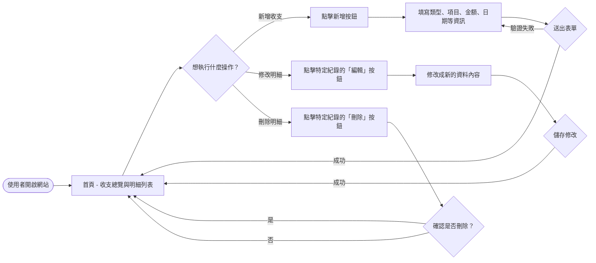
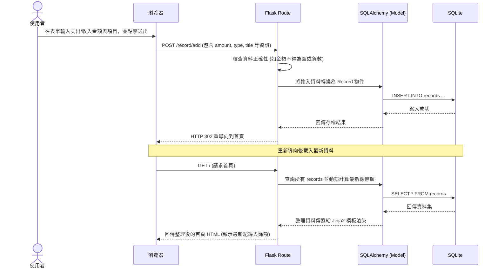

# 流程圖文件 (FLOWCHART) - 個人記帳簿系統

本文件根據 PRD 與系統架構設計，視覺化使用者的操作路徑與系統內部的資料流。

## 1. 使用者流程圖 (User Flow)

以下說明使用者進入系統後的各種操作路徑，涵蓋查看首頁、新增收支紀錄、編輯與刪除的基本流程。

## 2. 系統序列圖 (Sequence Diagram)

此處針對「**新增一筆收支紀錄**」這個最具代表性的功能，展開從前端使用者互動到後端資料庫互動的完整流程。

## 3. 功能清單對照表

我們將剛才梳理的使用者行為轉換成對應的路由與請求方式，為下一階段的 API 實作做準備：

| 功能名稱 | 說明 | HTTP 請求方法 | 預定 URL 路徑 |
| :--- | :--- | :--- | :--- |
| **首頁與明細** | 顯示總餘額計算結果，並條列所有收支紀錄 | GET | `/` |
| **新增紀錄頁面** | 展示用來新增一筆收入或支出的表單 | GET | `/record/add` |
| **提交新增紀錄** | 接收表單傳入的參數並真正寫入資料庫 | POST | `/record/add` |
| **編輯紀錄頁面** | 針對特定的一筆紀錄展示修改用的表單 | GET | `/record/edit/<int:id>` |
| **提交修改紀錄** | 接收編輯後的資料並覆寫該筆紀錄 | POST | `/record/edit/<int:id>` |
| **刪除特定紀錄** | 移除指定的收支紀錄 (僅接受 POST 防止意外 GET 請求) | POST | `/record/delete/<int:id>` |
